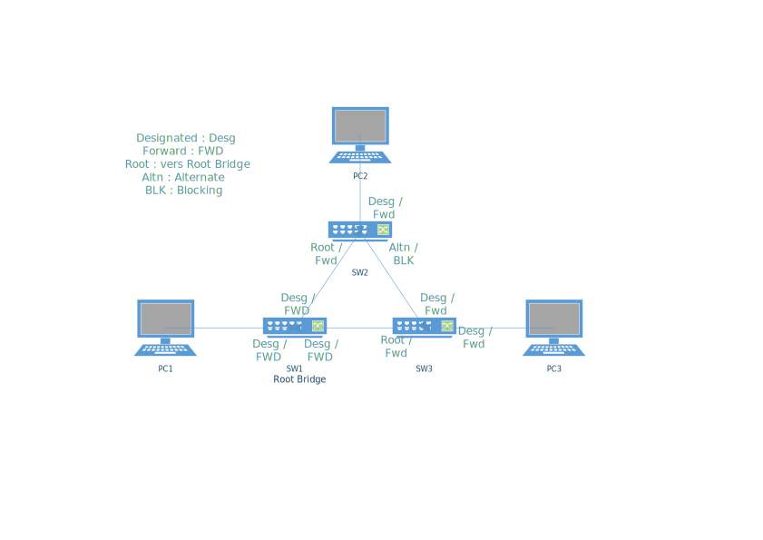

# TP2

- [TP2](#tp2)
  - [I. Simplest setup](#i-simplest-setup)
  - [II. More switches](#ii-more-switches)
  - [III. Isolation](#iii-isolation)
    - [1. Simple](#1-simple)
    - [2. Avec trunk](#2-avec-trunk)
  - [IV. Need perfs](#iv-need-perfs)

## I. Simplest setup

- Pour faire communiquer les 2 PCs afin de leurs permettre de se ping il faut leurs donner des adresses IPs
  - Exemple : PC1

```Cisco
PC1> ip 10.2.1.1 255.255.255.0
Checking for duplicate address...
PC1 : 10.2.1.1 255.255.255.0
```

- Ping `PC1` => `PC2` :

[Capture Wireshark](./ping1_cap.pcapng)

```cisco
PC1> arp

arp table is empty

PC1> ping 10.2.1.2
84 bytes from 10.2.1.2 icmp_seq=1 ttl=64 time=1.193 ms
84 bytes from 10.2.1.2 icmp_seq=2 ttl=64 time=1.399 ms
84 bytes from 10.2.1.2 icmp_seq=3 ttl=64 time=1.016 ms
84 bytes from 10.2.1.2 icmp_seq=4 ttl=64 time=1.128 ms
84 bytes from 10.2.1.2 icmp_seq=5 ttl=64 time=1.120 ms

PC1> arp

00:50:79:66:68:01  10.2.1.2 expires in 118 seconds
```

On peut voir sur la capture Wireshark que les `pings` utilisent le protocol `ICMP` (Internet Control Message Protocol) et également qu'avant ça il y a un échange `ARP` (Address Resolution Protocol) qui permet au 2 machines de se "reconnaitre".
Avant l'échange de paquets `ARP` la table et vide et après le `ping` provoquant un échange `ARP` la table est remplie.

Lors du premier `ping` PC1 fait une demande `ARP` pour avoir l'adresse MAC du `PC2` qui répond, `PC1` la sauvegarde dans sa table puis envoit un paquet `ICMP` mais pour la réponse c'est `PC2` qui fait une demande `ARP` à `PC1` qui répond et ensuite envoit la réponse du paquet `ICMP`.

- ARP PC1 -> PC2 :

1. (`MAC_PC1`) ==> (`Broadcast`) : "Qui est `IP_PC2` ? Demande `IP_PC1`"
2. (`MAC_PC2`) ==>  (`MAC_PC1`)  : "Je suis `IP_PC2` et j'ai l'adresse MAC `MAC_PC2`"

- ICMP PC1 -> PC2 :

1. (`IP_PC1`) ==> (`IP_PC2`) : "Echo request"
2. (`IP_PC2`) ==> (`IP_PC1`) : "Echo reply"

- **IP ou pas ?**
  - Les switchs l2 comme indiqué dans leurs noms n'ont pas besoin d' adresse IP car ils travaillent sur le couche n°2 du modèle OSI, il transmettent des trames en se basant sur lles adresses MACs et non IP.
  - Contrairement au switchs les machines ont besoin d'adresses IP pour faire un `ping` car il s'agit de paquet IPs utilisant le protocol ICMP donc de niveau 3.

## II. More switches

**Configuration IP des machines :**

- PC1 :

```cisco
II_PC1> ip 10.2.2.1/24
Checking for duplicate address...
PC1 : 10.2.2.1 255.255.255.0

II_PC1> save
Saving startup configuration to startup.vpc
.  done
```

- PC2 :

```cisco
II_PC2> ip 10.2.2.2/24
Checking for duplicate address...
PC1 : 10.2.2.2 255.255.255.0

II_PC2> save
Saving startup configuration to startup.vpc
.  done
```

- PC3 :

```cisco
II_PC3> ip 10.2.2.3/24
Checking for duplicate address...
PC1 : 10.2.2.3 255.255.255.0

II_PC3> save
Saving startup configuration to startup.vpc
.  done
```

**Pings :**\
Pour montrer que la topologie fonctionne la commande `ping` permet de faire le test.

- PC1 :

```cisco
II_PC1> ping 10.2.2.2 -c 2
84 bytes from 10.2.2.2 icmp_seq=1 ttl=64 time=0.945 ms
84 bytes from 10.2.2.2 icmp_seq=2 ttl=64 time=1.245 ms

II_PC1> ping 10.2.2.3 -c 2
84 bytes from 10.2.2.3 icmp_seq=1 ttl=64 time=1.269 ms
84 bytes from 10.2.2.3 icmp_seq=2 ttl=64 time=1.249 ms
```

- PC2 :

```cisco
II_PC2> ping 10.2.2.1 -c 2
84 bytes from 10.2.2.1 icmp_seq=1 ttl=64 time=1.674 ms
84 bytes from 10.2.2.1 icmp_seq=2 ttl=64 time=1.391 ms

II_PC2> ping 10.2.2.3 -c 2
84 bytes from 10.2.2.3 icmp_seq=1 ttl=64 time=1.470 ms
84 bytes from 10.2.2.3 icmp_seq=2 ttl=64 time=1.582 ms
```

- PC3 :

```cisco
II_PC3> ping 10.2.2.1 -c 2
84 bytes from 10.2.2.1 icmp_seq=1 ttl=64 time=1.316 ms
84 bytes from 10.2.2.1 icmp_seq=2 ttl=64 time=1.462 ms

II_PC3> ping 10.2.2.2 -c 2
84 bytes from 10.2.2.2 icmp_seq=1 ttl=64 time=1.802 ms
84 bytes from 10.2.2.2 icmp_seq=2 ttl=64 time=1.664 ms
```

**Analyse de la table MAC d'un switch :**

- Table MAC dde switch 1 :

```cisco
II_Sw1#sh mac add
          Mac Address Table
-------------------------------------------

Vlan    Mac Address       Type        Ports
----    -----------       --------    -----
   1    aabb.cc00.0310    DYNAMIC     Et0/3
   1    aabb.cc00.0410    DYNAMIC     Et0/2
   1    aabb.cc00.0430    DYNAMIC     Et0/3
Total Mac Addresses for this criterion: 3
```

Cette table contient les adresses MAC des autres switchs avec le Vlan auquel ils appartiennent ainsi que le port local a utilisé pour les joindre et leur type.\
L'adresse MAC `aabb.cc00.0310` présente sur le Vlan 1 décourverte automatiquement est accessible via le port `et0/3`.

**Les trames CDP :**\
CDP (Cisco Discovery Protocol) est un protocol propriétaire Cisco qui permet avec le protocol SNMP de découvrir le matériel connecté dans le voisinage comme les Switchs, Routeurs, etc... Les annonces CDP sont envoyées toutes les 60 secondes ce qui explique qu'on les repère facilement avec un outils de capture comme Wireshark.

**Spanning Tree Protocol :**

- Switch 1 :

```cisco
II_Sw1#sh sp

VLAN0001
  Spanning tree enabled protocol rstp
  Root ID    Priority    32769
             Address     aabb.cc00.0200
             This bridge is the root
             Hello Time   2 sec  Max Age 20 sec  Forward Delay 15 sec

  Bridge ID  Priority    32769  (priority 32768 sys-id-ext 1)
             Address     aabb.cc00.0200
             Hello Time   2 sec  Max Age 20 sec  Forward Delay 15 sec
             Aging Time  300 sec

Interface           Role Sts Cost      Prio.Nbr Type
------------------- ---- --- --------- -------- --------------------------------
Et0/0               Desg FWD 100       128.1    Shr
Et0/1               Desg FWD 100       128.2    Shr
Et0/2               Desg FWD 100       128.3    Shr
Et0/3               Desg FWD 100       128.4    Shr
Et1/0               Desg FWD 100       128.5    Shr
Et1/1               Desg FWD 100       128.6    Shr
Et1/2               Desg FWD 100       128.7    Shr
Et1/3               Desg FWD 100       128.8    Shr
Et2/0               Desg FWD 100       128.9    Shr
Et2/1               Desg FWD 100       128.10   Shr
Et2/2               Desg FWD 100       128.11   Shr
Et2/3               Desg FWD 100       128.12   Shr
Et3/0               Desg FWD 100       128.13   Shr
Et3/1               Desg FWD 100       128.14   Shr
Et3/2               Desg FWD 100       128.15   Shr
Et3/3               Desg FWD 100       128.16   Shr
Et4/0               Desg FWD 100       128.17   Shr
Et4/1               Desg FWD 100       128.18   Shr
Et4/2               Desg FWD 100       128.19   Shr
Et4/3               Desg FWD 100       128.20   Shr
Et5/0               Desg FWD 100       128.21   Shr
Et5/1               Desg FWD 100       128.22   Shr
Et5/2               Desg FWD 100       128.23   Shr
Et5/3               Desg FWD 100       128.24   Shr
Et6/0               Desg FWD 100       128.25   Shr
Et6/1               Desg FWD 100       128.26   Shr
Et6/2               Desg FWD 100       128.27   Shr
Et6/3               Desg FWD 100       128.28   Shr
Et7/0               Desg FWD 100       128.29   Shr
Et7/1               Desg FWD 100       128.30   Shr
Et7/2               Desg FWD 100       128.31   Shr
Et7/3               Desg FWD 100       128.32   Shr
```

- Switch 2 :

```cisco
II_Sw2#sh sp

VLAN0001
  Spanning tree enabled protocol rstp
  Root ID    Priority    32769
             Address     aabb.cc00.0200
             Cost        100
             Port        2 (Ethernet0/1)
             Hello Time   2 sec  Max Age 20 sec  Forward Delay 15 sec

  Bridge ID  Priority    32769  (priority 32768 sys-id-ext 1)
             Address     aabb.cc00.0400
             Hello Time   2 sec  Max Age 20 sec  Forward Delay 15 sec
             Aging Time  300 sec

Interface           Role Sts Cost      Prio.Nbr Type
------------------- ---- --- --------- -------- --------------------------------
Et0/0               Desg FWD 100       128.1    Shr
Et0/1               Root FWD 100       128.2    Shr
Et0/2               Desg FWD 100       128.3    Shr
Et0/3               Altn BLK 100       128.4    Shr
Et1/0               Desg FWD 100       128.5    Shr
Et1/1               Desg FWD 100       128.6    Shr
Et1/2               Desg FWD 100       128.7    Shr
Et1/3               Desg FWD 100       128.8    Shr
Et2/0               Desg FWD 100       128.9    Shr
Et2/1               Desg FWD 100       128.10   Shr
Et2/2               Desg FWD 100       128.11   Shr
Et2/3               Desg FWD 100       128.12   Shr
Et3/0               Desg FWD 100       128.13   Shr
Et3/1               Desg FWD 100       128.14   Shr
Et3/2               Desg FWD 100       128.15   Shr
Et3/3               Desg FWD 100       128.16   Shr
Et4/0               Desg FWD 100       128.17   Shr
Et4/1               Desg FWD 100       128.18   Shr
Et4/2               Desg FWD 100       128.19   Shr
Et4/3               Desg FWD 100       128.20   Shr
Et5/0               Desg FWD 100       128.21   Shr
Et5/1               Desg FWD 100       128.22   Shr
Et5/2               Desg FWD 100       128.23   Shr
Et5/3               Desg FWD 100       128.24   Shr
Et6/0               Desg FWD 100       128.25   Shr
Et6/1               Desg FWD 100       128.26   Shr
Et6/2               Desg FWD 100       128.27   Shr
Et6/3               Desg FWD 100       128.28   Shr
Et7/0               Desg FWD 100       128.29   Shr
Et7/1               Desg FWD 100       128.30   Shr
Et7/2               Desg FWD 100       128.31   Shr
Et7/3               Desg FWD 100       128.32   Shr
```

- Switch 3 :

```cisco
II_Sw3#sh sp

VLAN0001
  Spanning tree enabled protocol rstp
  Root ID    Priority    32769
             Address     aabb.cc00.0200
             Cost        100
             Port        2 (Ethernet0/1)
             Hello Time   2 sec  Max Age 20 sec  Forward Delay 15 sec

  Bridge ID  Priority    32769  (priority 32768 sys-id-ext 1)
             Address     aabb.cc00.0300
             Hello Time   2 sec  Max Age 20 sec  Forward Delay 15 sec
             Aging Time  300 sec

Interface           Role Sts Cost      Prio.Nbr Type
------------------- ---- --- --------- -------- --------------------------------
Et0/0               Desg FWD 100       128.1    Shr
Et0/1               Root FWD 100       128.2    Shr
Et0/2               Desg FWD 100       128.3    Shr
Et0/3               Desg FWD 100       128.4    Shr
Et1/0               Desg FWD 100       128.5    Shr
Et1/1               Desg FWD 100       128.6    Shr
Et1/2               Desg FWD 100       128.7    Shr
Et1/3               Desg FWD 100       128.8    Shr
Et2/0               Desg FWD 100       128.9    Shr
Et2/1               Desg FWD 100       128.10   Shr
Et2/2               Desg FWD 100       128.11   Shr
Et2/3               Desg FWD 100       128.12   Shr
Et3/0               Desg FWD 100       128.13   Shr
Et3/1               Desg FWD 100       128.14   Shr
Et3/2               Desg FWD 100       128.15   Shr
Et3/3               Desg FWD 100       128.16   Shr
Et4/0               Desg FWD 100       128.17   Shr
Et4/1               Desg FWD 100       128.18   Shr
Et4/2               Desg FWD 100       128.19   Shr
Et4/3               Desg FWD 100       128.20   Shr
Et5/0               Desg FWD 100       128.21   Shr
Et5/1               Desg FWD 100       128.22   Shr
Et5/2               Desg FWD 100       128.23   Shr
Et5/3               Desg FWD 100       128.24   Shr
Et6/0               Desg FWD 100       128.25   Shr
Et6/1               Desg FWD 100       128.26   Shr
Et6/2               Desg FWD 100       128.27   Shr
Et6/3               Desg FWD 100       128.28   Shr
Et7/0               Desg FWD 100       128.29   Shr
Et7/1               Desg FWD 100       128.30   Shr
Et7/2               Desg FWD 100       128.31   Shr
Et7/3               Desg FWD 100       128.32   Shr
```

Avec le résultat de ses commandes on peut voir que le `Root Bridge` est le Switch 1 et que le seul port désactivé est `et0/3` sur le Switch 2.  



- Ping PC2 -> PC3 :

[Capture Wireshark](./Ping_PC1-PC2.pcap)

En faisant la capture sur le lien entre `SW1` et `SW3` on voit que le chemin parcouru par les trames émises par le ping est `PC2 -> SW2 -> SW1 -> SW3 -> PC3` puis le retour. Ce qui signifi donc que le lien désactiver est celui entre `SW2` et `SW3`.

- ARP (Ping PC2 -> PC3) :

```ascii
PC2 -> SW2 -> SW1 -|-> SW3 -> PC3 -|
^                  |-> PC1         |
|----------------------------------|
```

Ce schéma représente le chemin des trames ARP lorsque PC2 fait un ping vers PC3.

**Reconfigurer STP :**

- SW3 :

```cisco
II_Sw3(config)#spanning-tree vlan 1 priority 4096
II_Sw3(config)#do sh sp

VLAN0001
  Spanning tree enabled protocol rstp
  Root ID    Priority    4097
             Address     aabb.cc00.0300
             This bridge is the root
             Hello Time   2 sec  Max Age 20 sec  Forward Delay 15 sec

  Bridge ID  Priority    4097   (priority 4096 sys-id-ext 1)
             Address     aabb.cc00.0300
             Hello Time   2 sec  Max Age 20 sec  Forward Delay 15 sec
             Aging Time  300 sec

Interface           Role Sts Cost      Prio.Nbr Type
------------------- ---- --- --------- -------- --------------------------------
Et0/0               Desg FWD 100       128.1    Shr
Et0/1               Desg FWD 100       128.2    Shr
Et0/2               Desg FWD 100       128.3    Shr
Et0/3               Desg FWD 100       128.4    Shr
Et1/0               Desg FWD 100       128.5    Shr
Et1/1               Desg FWD 100       128.6    Shr
Et1/2               Desg FWD 100       128.7    Shr
Et1/3               Desg FWD 100       128.8    Shr
Et2/0               Desg FWD 100       128.9    Shr
Et2/1               Desg FWD 100       128.10   Shr
Et2/2               Desg FWD 100       128.11   Shr
Et2/3               Desg FWD 100       128.12   Shr
Et3/0               Desg FWD 100       128.13   Shr
Et3/1               Desg FWD 100       128.14   Shr
Et3/2               Desg FWD 100       128.15   Shr
Et3/3               Desg FWD 100       128.16   Shr
Et4/0               Desg FWD 100       128.17   Shr
Et4/1               Desg FWD 100       128.18   Shr
Et4/2               Desg FWD 100       128.19   Shr
Et4/3               Desg FWD 100       128.20   Shr
Et5/0               Desg FWD 100       128.21   Shr
Et5/1               Desg FWD 100       128.22   Shr
Et5/2               Desg FWD 100       128.23   Shr
Et5/3               Desg FWD 100       128.24   Shr
Et6/0               Desg FWD 100       128.25   Shr
Et6/1               Desg FWD 100       128.26   Shr
Et6/2               Desg FWD 100       128.27   Shr
Et6/3               Desg FWD 100       128.28   Shr
Et7/0               Desg FWD 100       128.29   Shr
Et7/1               Desg FWD 100       128.30   Shr
Et7/2               Desg FWD 100       128.31   Shr
Et7/3               Desg FWD 100       128.32   Shr
```

On peut voir qu'en donnant à SW3 une priorité supérieur (multiple de 4096 le bas) ce switch devient le `Root Bridge`

**STP & Perfs :**

[Capture Wireshark avant modification](./STP_before.pcap)

Pour améliorer les performance on va désactiver STP et CDP sur le lien reliant `SW1` et `PC1`.

```cisco
II_Sw1(config)#int e0/0
II_Sw1(config-if)#sw m ac
II_Sw1(config-if)#spanning-tree portfast
%Warning: portfast should only be enabled on ports connected to a single
 host. Connecting hubs, concentrators, switches, bridges, etc... to this
 interface  when portfast is enabled, can cause temporary bridging loops.
 Use with CAUTION

%Portfast has been configured on Ethernet0/1 but will only
 have effect when the interface is in a non-trunking mode.
II_Sw1(config-if)#sp bpduguard enable
II_Sw1(config-if)#sp bpdufilter enable
II_Sw1(config-if)#no cdp enable
```

Après avoir fait une [capture](./STP_after.pcap) on peut voir la différence, il ne reste plus que le flux généré par le protocol DTP.

## III. Isolation

### 1. Simple

**Configuration du switch :**

- Définition des Vlans :

```cisco
III1_SW1(config)#vlan 10
III1_SW1(config-vlan)#name PC1
III1_SW1(config-vlan)#vlan20
                      ^
% Invalid input detected at '^' marker.

III1_SW1(config-vlan)#vlan 20
III1_SW1(config-vlan)#name PC2_PC3
```

- Configuration des interfaces :

```cisco
III1_SW1(config)#int e0/1
III1_SW1(config-if)#sw m ac
III1_SW1(config-if)#sw ac v 10
III1_SW1(config-if)#int e0/2
III1_SW1(config-if)#sw m ac
III1_SW1(config-if)#sw ac v 20
III1_SW1(config-if)#int e0/3
III1_SW1(config-if)#sw m ac
III1_SW1(config-if)#sw ac v 20
```

- Sauvegarde de la configuration :

```cisco
III1_SW1(config-if)#exit
III1_SW1(config)#do wr
Warning: Attempting to overwrite an NVRAM configuration previously written
by a different version of the system image.
Overwrite the previous NVRAM configuration?[confirm]
Building configuration...
Compressed configuration from 2693 bytes to 1171 bytes[OK]
```

**Configuration des clients :**

- `PC1` :

```cisco
PIII1_C2> set pcname PC1

III1_PC1> ip 10.2.3.1/24
Checking for duplicate address...
PC1 : 10.2.3.1 255.255.255.0

III1_PC1> save
Saving startup configuration to startup.vpc
.  done
```

- `PC2` :

```cisco
PIII1_C2> set pcname PC2

III1_PC2> ip 10.2.3.2/24
Checking for duplicate address...
PC1 : 10.2.3.2 255.255.255.0

III1_PC2> save
Saving startup configuration to startup.vpc
.  done
```

- `PC3` :

```cisco
PIII1_C2> set pcname PC3

III1_PC3> ip 10.2.3.3/24
Checking for duplicate address...
PC1 : 10.2.3.3 255.255.255.0

III1_PC3> save
Saving startup configuration to startup.vpc
.  done
```

**Pings :**

- `PC2` ne peut ping que `PC3` :

```cisco
PC2> ping 10.2.3.1
host (10.2.3.1) not reachable

PC2> ping 10.2.3.2 -c 2
10.2.3.2 icmp_seq=1 ttl=64 time=0.001 ms
10.2.3.2 icmp_seq=2 ttl=64 time=0.001 ms
```

- `PC1` ne peut joindre personne (c'est vrai que c'est triste):

```cisco
III1_PC1> ping 10.2.3.2
host (10.2.3.2) not reachable

III1_PC1> ping 10.2.3.3
host (10.2.3.3) not reachable
```

### 2. Avec trunk

**Configuration des switchs :**\
*La configuration est identique sur les deux switchs sauf le hostname (suffit de bien penser au câblage et aux ports utilisés)*

- Définition des Vlans :

```cisco
III2_SW1(config)#hostname SW1
SW1(config)#vlan 10
SW1(config-vlan)#name PC1_PC3
SW1(config-vlan)#vlan 20
SW1(config-vlan)#name PC2_PC4
```

- Configuration des interfaces `access` :

```cisco
SW1(config)#int e0/1
SW1(config-if)#sw m ac
SW1(config-if)#sw ac v 10
SW1(config-if)#int e0/2
SW1(config-if)#sw m ac
SW1(config-if)#sw ac v 20
```

- Configuration de l'interface `trunk` :

```cisco
SW1(config-if)#int e0/0
SW1(config-if)#sw t e d
SW1(config-if)#sw t a v 10,20
SW1(config-if)#sw m t
*Oct  7 18:08:18.035: %LINEPROTO-5-UPDOWN: Line protocol on Interface Ethernet0/0, changed state to down
*Oct  7 18:08:19.625: %LINEPROTO-5-UPDOWN: Line protocol on Interface Ethernet0/0, changed state to up
```

**Pings de test :**

- `PC1` ne peut joindre que `PC3` :

```cisco
PC1> ping 10.2.20.1
No gateway found

PC1> ping 10.2.10.2 -c 2
84 bytes from 10.2.10.2 icmp_seq=1 ttl=64 time=1.937 ms
84 bytes from 10.2.10.2 icmp_seq=2 ttl=64 time=1.697 ms

PC1> ping 10.2.20.2
No gateway found
```

- `PC4` ne peut joindre que `PC2` :

```cisco
PC4> ping 10.2.10.1
No gateway found

PC4> ping 10.2.20.1 -c 2
84 bytes from 10.2.20.1 icmp_seq=1 ttl=64 time=3.313 ms
84 bytes from 10.2.20.1 icmp_seq=2 ttl=64 time=2.252 ms

PC4> ping 10.2.10.2
No gateway found
```

**Capture Wireshark :**

[Résultat de la capture](./Ping_III2.pcap)\
*Normalement sur la capture on devrait voir que les paquets ont un tag vlan mais pour une raison inconnu ce n'est pas mon cas sur wireshark, la configuration sur les switchs est pourtant bonne donc ça reste un mystère*

## IV. Need perfs

**Configuration des switchs :**\
*La configuration reste presque identique que pour la section précédente hormis pour le trunk car le lien est doublé et que l'objectif est de mettre en place `LACP`*

- Définition des Vlans :

```cisco
III2_SW1(config)#hostname SW1
SW1(config)#vlan 10
SW1(config-vlan)#name PC1_PC3
SW1(config-vlan)#vlan 20
SW1(config-vlan)#name PC2_PC4
```

- Configuration des interfaces `access` :

```cisco
SW1(config)#int e1/1
SW1(config-if)#sw m ac
SW1(config-if)#sw ac v 10
SW1(config-if)#int e1/2
SW1(config-if)#sw m ac
SW1(config-if)#sw ac v 20
```

- Configuration de `LACP` :

```cisco
SW1(config)#int r e0/0-1
SW1(config-if-range)#channel-g 1 m ac
Creating a port-channel interface Port-channel 1
*Oct  7 19:40:20.008: %LINEPROTO-5-UPDOWN: Line protocol on Interface Ethernet0/0, changed state to down
*Oct  7 19:40:20.008: %LINEPROTO-5-UPDOWN: Line protocol on Interface Ethernet0/1, changed state to down
*Oct  7 19:40:24.884: %LINEPROTO-5-UPDOWN: Line protocol on Interface Ethernet0/1, changed state to up
*Oct  7 19:40:24.884: %LINEPROTO-5-UPDOWN: Line protocol on Interface Ethernet0/0, changed state to up
SW1(config-if-range)#channel-p lacp
*Oct  7 19:40:27.375: %EC-5-L3DONTBNDL2: Et0/1 suspended: LACP currently not enabled on the remote port.
*Oct  7 19:40:27.905: %EC-5-L3DONTBNDL2: Et0/0 suspended: LACP currently not enabled on the remote port.

SW1(config-if-range)#do sh etherchannel sum
Flags:  D - down        P - bundled in port-channel
        I - stand-alone s - suspended
        H - Hot-standby (LACP only)
        R - Layer3      S - Layer2
        U - in use      N - not in use, no aggregation
        f - failed to allocate aggregator

        M - not in use, minimum links not met
        m - not in use, port not aggregated due to minimum links not met
        u - unsuitable for bundling
        w - waiting to be aggregated
        d - default port

        A - formed by Auto LAG


Number of channel-groups in use: 1
Number of aggregators:           1

Group  Port-channel  Protocol    Ports
------+-------------+-----------+-----------------------------------------------
1      Po1(SU)         LACP      Et0/0(P)    Et0/1(P)
```

- Configuration de l'interface `trunk` :

```cisco
SW1(config)#int po1
SW1(config-if)#sw t e d
SW1(config-if)#sw m t
SW1(config-if)#
*Oct  7 19:50:03.784: %LINK-3-UPDOWN: Interface Port-channel1, changed state to down
*Oct  7 19:50:04.789: %LINEPROTO-5-UPDOWN: Line protocol on Interface Port-channel1, changed state to down
SW1(config-if)#
*Oct  7 19:50:09.740: %LINK-3-UPDOWN: Interface Port-channel1, changed state to up
*Oct  7 19:50:10.745: %LINEPROTO-5-UPDOWN: Line protocol on Interface Port-channel1, changed state to up
SW1(config-if)#sw t a v 10,20
SW1(config-if)#do sh int tr

Port        Mode             Encapsulation  Status        Native vlan
Po1         on               802.1q         trunking      1

Port        Vlans allowed on trunk
Po1         10,20

Port        Vlans allowed and active in management domain
Po1         10,20

Port        Vlans in spanning tree forwarding state and not pruned
Po1         10,20
```

[Capture des trames LACP](./lacp.pcap), sur cette capture on peut voir que plus ou moins une trame sur deux est une trame du protocol LACP.

```cisco
SW1#sh interfaces po1
Port-channel1 is up, line protocol is up (connected)
  Hardware is EtherChannel, address is aabb.cc00.0800 (bia aabb.cc00.0800)
  MTU 1500 bytes, BW 20000 Kbit/sec, DLY 100 usec,
     reliability 255/255, txload 1/255, rxload 1/255
  Encapsulation ARPA, loopback not set
  Keepalive set (10 sec)
  Auto-duplex, Auto-speed, media type is unknown
  input flow-control is off, output flow-control is unsupported
  Members in this channel: Et0/0 Et0/1
  ARP type: ARPA, ARP Timeout 04:00:00
  Last input 00:00:13, output never, output hang never
  Last clearing of "show interface" counters never
  Input queue: 0/2000/0/0 (size/max/drops/flushes); Total output drops: 0
  Queueing strategy: fifo
  Output queue: 0/40 (size/max)
  5 minute input rate 0 bits/sec, 0 packets/sec
  5 minute output rate 0 bits/sec, 0 packets/sec
     183 packets input, 10843 bytes, 0 no buffer
     Received 183 broadcasts (0 multicasts)
     0 runts, 0 giants, 0 throttles
     0 input errors, 0 CRC, 0 frame, 0 overrun, 0 ignored
     0 input packets with dribble condition detected
     1024 packets output, 86626 bytes, 0 underruns
     0 output errors, 0 collisions, 0 interface resets
     0 unknown protocol drops
     0 babbles, 0 late collision, 0 deferred
     0 lost carrier, 0 no carrier
     0 output buffer failures, 0 output buffers swapped out
SW1#
SW1#sh interfaces e0/0
Ethernet0/0 is up, line protocol is up (connected)
  Hardware is AmdP2, address is aabb.cc00.0800 (bia aabb.cc00.0800)
  MTU 1500 bytes, BW 10000 Kbit/sec, DLY 1000 usec,
     reliability 255/255, txload 1/255, rxload 1/255
  Encapsulation ARPA, loopback not set
  Keepalive set (10 sec)
  Auto-duplex, Auto-speed, media type is unknown
  input flow-control is off, output flow-control is unsupported
  ARP type: ARPA, ARP Timeout 04:00:00
  Last input 00:00:18, output 00:00:01, output hang never
  Last clearing of "show interface" counters never
  Input queue: 0/2000/0/0 (size/max/drops/flushes); Total output drops: 0
  Queueing strategy: fifo
  Output queue: 0/0 (size/max)
  5 minute input rate 0 bits/sec, 0 packets/sec
  5 minute output rate 0 bits/sec, 0 packets/sec
     254 packets input, 34765 bytes, 0 no buffer
     Received 220 broadcasts (0 multicasts)
     0 runts, 0 giants, 0 throttles
     0 input errors, 0 CRC, 0 frame, 0 overrun, 0 ignored
     0 input packets with dribble condition detected
     1151 packets output, 95802 bytes, 0 underruns
     0 output errors, 0 collisions, 0 interface resets
     0 unknown protocol drops
     0 babbles, 0 late collision, 0 deferred
     0 lost carrier, 0 no carrier
     0 output buffer failures, 0 output buffers swapped out
```

Maintenant on peut voir que la bande passante de l'interface po1 est le double d'une unique interface du groupe.
*La commande `show ip interface po1` du tp ne donne pas résultat nécéssaire à la visualisation de cette information*
