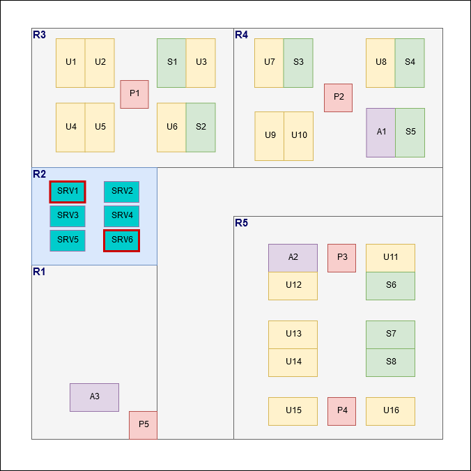
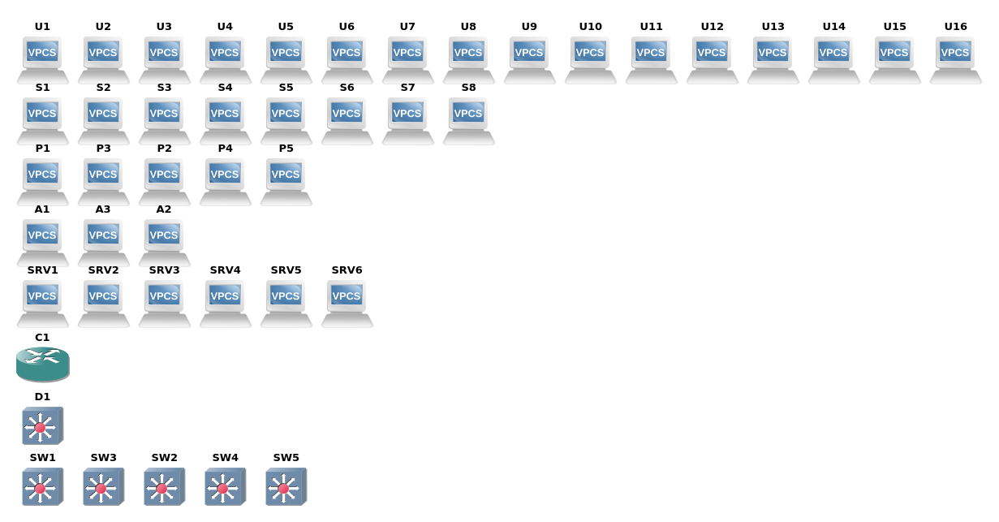
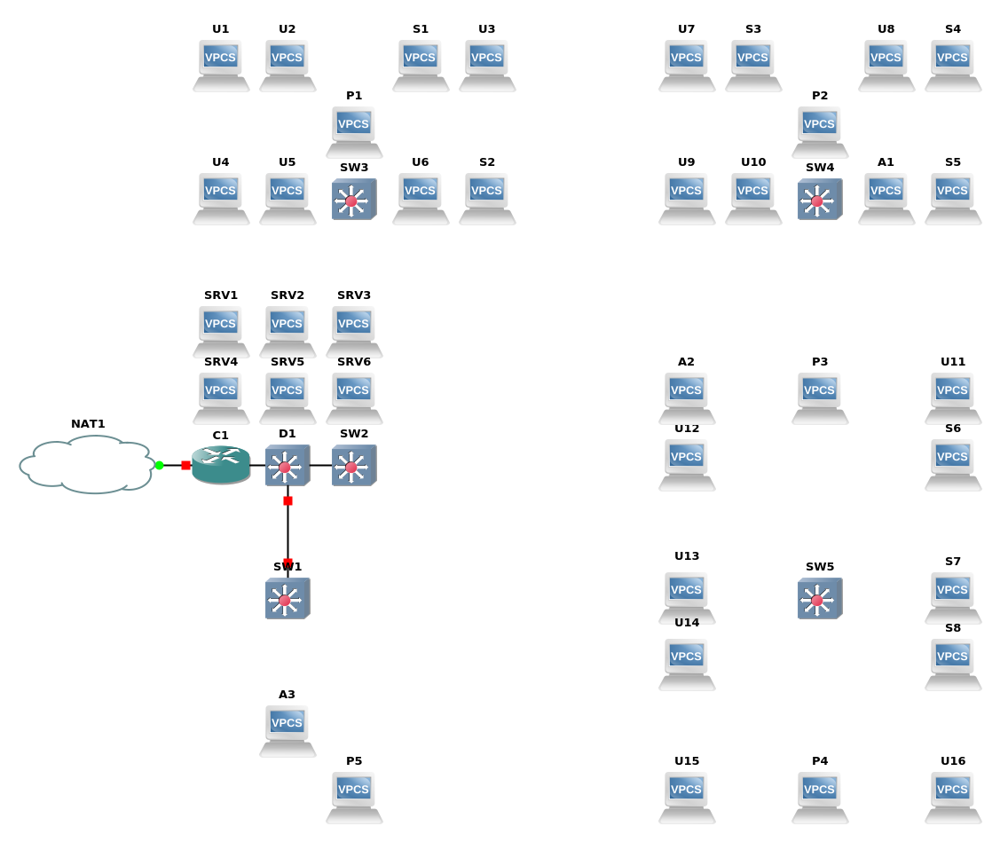
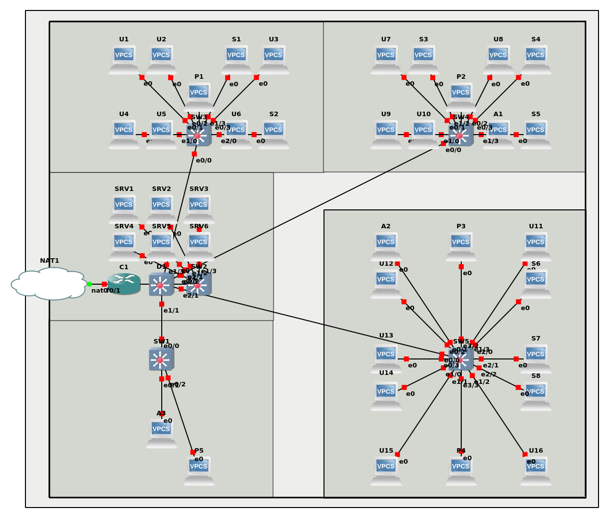

# TP3

## I. Router-on-a-stick

**Schéma :**

``` ascii
             +--+
             |R1|
             +-++
               |
               |                    +---+
               |          +---------+PC4|
+---+        +-+-+      +---+       +---+
|PC1+--------+SW1+------+SW2|
+---+        +-+-+      +-+--+
               |          |  |
               |          |  +------+--+
               |          |         |P1|
             +-+-+      +-+-+       +--+
             |PC2|      |PC3|
             +---+      +---+
```

**Tableau des réseaux utilisés :**

Réseau | Adresse | VLAN | Description
--- | --- | --- | ---
`net1` | `10.3.10.0/24` | 10 | Utilisateurs
`net2` | `10.3.20.0/24` | 20 | Admins
`net3` | `10.3.30.0/24` | 30 | Visiteurs
`netP` | `10.3.40.0/24` | 40 | Imprimantes

**Tableau d'adressage :**

Machine | VLAN | IP `net1` | IP `net2` | IP `net3` |  IP `netP`
--- | --- | --- | --- | --- | ---
PC1 | 10 | `10.3.10.1/24` | x | x | x
PC2 | 20 | x | `10.3.20.2/24` | x | x | x
PC3 | 30 | x | `10.3.20.3/24` | x | x | x
PC4 | 30 | x | x |  `10.3.30.4/24` | x | x
P1 | 40 | x | x | x | `10.3.40.1/24`
R1 | x |  `10.3.10.254/24` | `10.3.20.254/24` | `10.3.30.254/24` | `10.3.40.254/24`

### Configuration des clients et de l'imprimantes

[script de configuration](./I/VPCS.tcl)

### Configuration du routeur

[script de configuration](./I/Router.tcl)

### Configuration du switch

[script de configuration](./I/Switch.tcl)

### Vérification

Il suffit de faire quelques pings afin de vérifier que les machines communiques ou non.

```cisco
PC2> ping 10.3.30.4 #PC4
84 bytes from 10.3.30.4 icmp_seq=1 ttl=63 time=14.649 ms
84 bytes from 10.3.30.4 icmp_seq=2 ttl=63 time=11.402 ms
84 bytes from 10.3.30.4 icmp_seq=3 ttl=63 time=13.629 ms
84 bytes from 10.3.30.4 icmp_seq=4 ttl=63 time=13.996 ms
^C
PC2> ping 10.3.10.1 #PC1
10.3.10.1 icmp_seq=1 timeout
10.3.10.1 icmp_seq=2 timeout
10.3.10.1 icmp_seq=3 timeout
10.3.10.1 icmp_seq=4 timeout
10.3.10.1 icmp_seq=5 timeout
```

## II. Cas concret

### Théoriquement

Maintenant il faut mettre en place une infra réaliste et un peu plus complète.\
Mon idée première en voyant ce qui était demandé était de faire du failover mais pour respecter la date de rendu j'ai choisi de rester sur quelque chose de plus simple.

Pour rappel voici les bureaux pour lequels il faut créé l'infra :


Ceci fait donc un total de 38 machines, 16 utilisateurs, 8 stagiaires, 5 imprimantes, 3 administrateurs et 6 serveurs donc 2 sensibles. Ensuite il faut rajouter des équipements réseaux afin de conecter tout ce beau monde, pour rester sur quelque chose de simple il faudrait un routeur (également connecté à une nat) nommé `C1` (Core 1), un switch par bureau (soit 5) nommés `SWx` (Switch x) plus 1 switch nommé `D1` (Distribution 1) supplémentaire pour connecté le tout, il faut donc 1 routeur et 6 switchs.

Une capture d'écran pour résumé le tout (c'est pas joli je sais) :


**Les Machines :**

| Machines | IP               | Réseau           | Masque          | Vlan |
|:--------:|:----------------:|:----------------:|:---------------:|:----:|
| U1-16    | 192.168.110.1-16 | 192.168.110.0/27 | 255.255.255.224 | 10   |
| S1-8     | 192.168.120.1-8  | 192.168.120.0/28 | 255.255.255.240 | 20   |
| P1-5     | 192.168.130.1-5  | 192.168.130.0/28 | 255.255.255.240 | 30   |
| A1-3     | 192.168.140.1-3  | 192.168.140.0/29 | 255.255.255.248 | 40   |
| SRV2-5   | 192.168.150.1-4  | 192.168.150.0/29 | 255.255.255.248 | 50   |
| SRV1&6   | 192.168.160.1-2  | 192.168.160.0/29 | 255.255.255.248 | 60   |

**Les interfaces pour C1 :**

| Interfaces | IP               | Réseau           | Masque          | Vlan |
|:----------:|:----------------:|:----------------:|:---------------:|:----:|
|  fe0/0.10  | 192.168.110.30   | 192.168.110.0/27 | 255.255.255.224 | 10   |
|  fe0/0.20  | 192.168.120.14   | 192.168.120.0/28 | 255.255.255.240 | 20   |
|  fe0/0.30  | 192.168.130.14   | 192.168.130.0/28 | 255.255.255.240 | 30   |
|  fe0/0.40  | 192.168.140.6    | 192.168.140.0/29 | 255.255.255.248 | 40   |
|  fe0/0.50  | 192.168.150.6    | 192.168.150.0/29 | 255.255.255.248 | 50   |
|  fe0/0.60  | 192.168.160.6    | 192.168.160.0/29 | 255.255.255.248 | 60   |

**Les Vlans :**

| Vlans | Nom                |
|:-----:|:------------------:|
| 10    | Utilisateurs       |
| 20    | Stagiaires         |
| 30    | Imprimantes        |
| 40    | Administrateurs    |
| 50    | Serveurs           |
| 60    | Serveurs Sensibles |

Pour la câblage il faut utilisé courts dans toute la salle R2 (Salle serveur) en supposant que touts les équipements sont en rack puis pour la liaison entre les switchs de R2 vers les autres salles il faut utiliser des câbles longs (pour R1 et R3 on peut dire que c'est variable en fonction du placement des switchs) et enfin à l'intérieur des salles il faudrait utiliser des câbles moyens (toujours à adapté en fonction du placement du switch et du matériel).

**Voilà le résulat propre :**
*L'affichage des labels des interfaces c'est pratique mais ici c'est illisible.*
*Et en vrai Léo la prochaine infra fais là en large ça passera mieux sur GNS3*



**Et moins propre aussi :**


### Pour la configuration des VPCS

Je vais pas tout détailler par écrit les fichiers de configuration sont plus explicites (vive les scripts parce que 38 machines à la main c'est pas ouff ouff).

- Les imprimantes :
[Imprimantes](II/Printer.tcl)
- Les utilisateurs :
[Utilisateurs](II/Users.tcl)
- Les stagiaires :
[Stagiaires](II/Stagiaires.tcl)
- Les Serveurs :
[Serveurs](II/Servers.tcl)
- Les Serveurs Sensibles :
[Serveurs Sensibles](II/Servers_Sensibles.tcl)
- Les Admins :
[Admins](II/Admins.tcl)

*Et donc pour le VPCS avec Except ça fonctionne, il reste à voir plus les switchs et le routeur si c'est aussi "facile" !*

### Configuration des Switchs

Là aussi les scripts seront plus explicites. Le script est en deux parties, une pour le switch principal et l'autre pour les switchs d'accès.

[Configuration Switchs](II/Init_Switch.tcl)

### Configuration du Routeur

[Configuration du Routeur](II/Router.tcl)

### Tests avant de continuer la configuration du réseau

Pour réaliser ces tests il suffit de faire quelques pings sachant que pour l'instant toutes les machines doivent pouvoir se joindre.

[Script](II/test1.tcl)

Et la sortie de la commande ./test1.tcl > test1.log [ici](II/test1.log)

### Autorisations

Pour mettre en place les exeptions du tableau il faut mettre en place des ACLs.\
*Et c'était très long à faire :'(*

[Configuration des ACL](II/acl.tcl)
